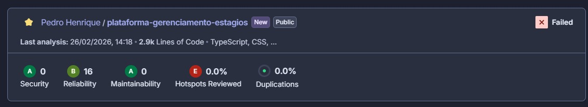

# Plataforma de Gerenciamento de Estágios e Oportunidades de Carreira

## :octocat: Integrantes

- [Pedro Henrique Matos Oliveira](https://github.com/Pedro-Matos19)
- [Kévna Tenório Brito Cavalcanti](https://github.com/kevna2329)
- [Antônio Carlos Batista Vaz](https://github.com/AntonioCVaz)
- [João Henrique Araújo de Souza](https://github.com/jota-aga)
- [José Uilton Ferreira de Siqueira](https://github.com/joseuilton)

## 📃 Sobre o Projeto

Projeto para desenvolvimento de um software Web completo (Frontend e Backend) para a disciplina de **Engenharia de Software**, ministrada pela Professora **Thaís Alves Burity Rocha**, na Universidade Federal do Agreste de Pernambuco (UFAPE). O projeto visa a avaliação da 2ª Verificação de Aprendizagem.

O sistema consiste em uma **Plataforma de Gerenciamento de Estágios**, que tem como objetivo conectar discentes, empresas e a instituição de ensino. A plataforma permitirá que empresas divulguem vagas, alunos se candidatem a oportunidades e a instituição gerencie os contratos e documentos de estágio de forma centralizada e eficiente.

## 📍 Objetivos

O objetivo principal é aplicar os conhecimentos de desenvolvimento colaborativo e arquitetura de software. Funcionalmente, o sistema visa:

- Facilitar o cadastro de empresas e a divulgação de oportunidades de estágio e emprego.
- Permitir que discentes cadastrem seus currículos e se apliquem às vagas.
- Otimizar o acompanhamento dos processos seletivos e a gestão de documentos de estágio.

## 🚀 Aplicação em Produção (Render)

- [Frontend](https://frontend-estagios.onrender.com)
- [Backend](https://backend-estagios.onrender.com)

## 🛠 Tecnologias Usadas

O projeto está estruturado em dois diretórios principais (`/backend` e `/frontend`), utilizando:

### Backend

- **Java** (Linguagem)
- **Spring Boot** (Framework)
- **Spring Data JPA** (Persistência)
- **PostgreSQL** (Banco de Dados)
- **Docker** (Containerização)
- **JaCoCo & SonarCloud** (Cobertura e Qualidade de Código)

### Frontend

- **Angular** (Framework Web)
- **TypeScript**
- **HTML/CSS**

## 🚧 Status do Projeto

### ✅ Iteração 1: Infraestrutura (Concluída)

- [X] Configuração do ambiente Java e Spring Boot.
- [X] Configuração do banco de dados PostgreSQL.
- [X] Inicialização do projeto Frontend com Angular.
- [X] Criação dos repositórios e versionamento inicial.

### ✅ Iteração 2: Autenticação e Segurança (Concluída)

**Backend (Finalizado):**
- [X] Implementação do Spring Security e JWT.
- [X] Criação da entidade Usuário e perfis (Admin/User).
- [X] Endpoints de Login e Registro.

**Frontend (Finalizado):**
- [X] Desenvolvimento da tela de Login.
- [X] Integração com a API.

### ✅ Iteração 3: Gerenciamento de Vagas (Concluída)

**Backend (Finalizado):**
- [X] Criação da entidade Vaga, DTOs e Enumerações (Localização, Tipo de Vaga).
- [X] Restrição de segurança (Apenas empresas criam/editam vagas).
- [X] Endpoints CRUD de Vagas (`/api/vagas`).
- [X] Testes unitários do serviço de vagas e implementação de filtros dinâmicos.

**Frontend (Finalizado):**
- [X] Serviço Angular (`JobsService`) com injeção de Token JWT.
- [X] Tela de Listagem de Vagas disponíveis.
- [X] Tela de Criação de Vagas com validação de formulário.
- [X] Testes unitários e integração nos principais services.

### ✅ Iteração 4: Qualidade, CI/CD e Implantação (Concluída)

**Integração Contínua (CI) e Qualidade:**
- [X] Configuração do ambiente de testes no Backend (`application-test.properties`).
- [X] Configuração do JaCoCo no Backend para relatórios de cobertura de código.
- [X] Configuração do pipeline no GitHub Actions para o Backend (Build, Testes, JaCoCo e SonarCloud).
- [X] Configuração do pipeline no GitHub Actions para o Frontend (Build e Testes).
- [X] Integração do Backend com a versão gratuita do SonarCloud.
- [X] Refatoração de código para atender aos critérios de qualidade (0 bugs de segurança, 0 code smells críticos, < 20% de duplicação).

**Implantação Contínua (CD) e Release:**
- [X] Containerização da aplicação com Docker.
- [X] Implantação automatizada do Backend no Render.
- [X] Implantação automatizada do Frontend no Render.
- [X] Publicação do Release final da iteração no repositório.

#### 
Evidências execução SonarCloud

### 🚧 Iteração 5: Candidaturas e Processo Seletivo (Em Andamento)

Nesta etapa, o foco é a implementação do fluxo completo de seleção, permitindo a interação direta entre estudantes e empresas através de candidaturas e agendamentos.

**Histórias de Usuário (H6 a H9):**
- [x] **H6 – Candidatura a vaga:** Permite que estudantes autenticados se candidatem a vagas ativas, com validação de candidatura única por vaga.
- [x] **H7 – Acompanhamento de candidatura:** Interface para o estudante visualizar o status das suas candidaturas (Em análise, Entrevista, Aprovado, Recusado).
- [x] **H8 – Gerenciamento de Candidaturas (Empresa):** Permite que as empresas visualizem perfis de candidatos e alterem o status das candidaturas recebidas. **(Em desenvolvimento)**
- [x] **H9 – Agendamento de entrevista:** Sistema de agendamento com definição de data, hora e formato (online/presencial), incluindo validação de conflitos de horário para o candidato. **(Em desenvolvimento)**

**Qualidade, Testes e Integração:**
- [x] **Evolução da Cobertura (JaCoCo):** Expansão da suíte de testes para atingir a meta mínima de **70% de instruções** e **80% de branches** cobertas no Backend.
- [x] **Manutenção de Qualidade (SonarCloud):** Garantia de 0 Security Issues, 0 Maintainability Issues e duplicação de código abaixo de 20%.
- [x] **Integração Front-Back:** Garantir que todas as novas funcionalidades de candidatura e agendamento estejam comunicando perfeitamente em produção (Render).
- [x] **Novo Release:** Publicação da versão estável da Quinta Iteração no GitHub.

### 🚧 Iteração 6: Correções, Integração e Novas Funcionalidades (Em Andamento)

Nesta etapa, o foco é a correção de pendências das revisões passadas, a implementação das histórias de usuário especificadas no Quadro Scrum, a garantia de integração total entre os sistemas e a manutenção rigorosa das métricas de qualidade de código.

**Histórias de Usuário e Funcionalidades:**
- [ ] **H10 – Registro de resultado da entrevista:** Permitir que a empresa registre a aprovação ou reprovação de um candidato após a fase de entrevistas.
- [ ] **H11 – Notificação de resultado da candidatura:** Disparar e exibir avisos automáticos para os estudantes informando se foram aprovados ou reprovados nas seleções.
- [ ] **Integração Total:** Garantir integração total entre o frontend e o backend, permitindo acesso às novas funcionalidades apenas por usuários autenticados e autorizados.
- [ ] **Correções Pendentes:** Concluir a correção de todos os problemas e bugs apontados nas revisões das iterações anteriores.

**Qualidade, Testes e Entrega:**
- [ ] **Cobertura de Testes (JaCoCo):** Manter a cobertura mínima de **70% de instruções** e **80% de branches** no Backend.
- [ ] **Qualidade de Código (SonarCloud):** Assegurar 0 Security Issues, 0 Maintainability Issues e duplicação de código abaixo de 20%.
- [ ] **Novo Release:** Publicação da versão estável da Sexta Iteração no repositório principal (RP).